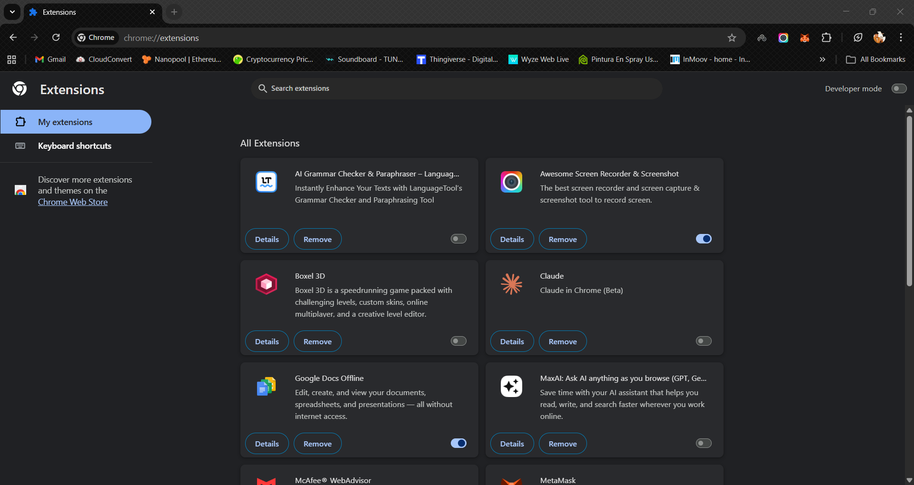
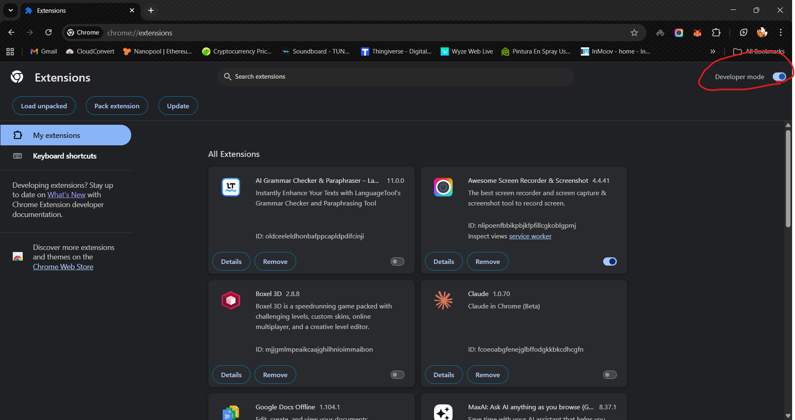
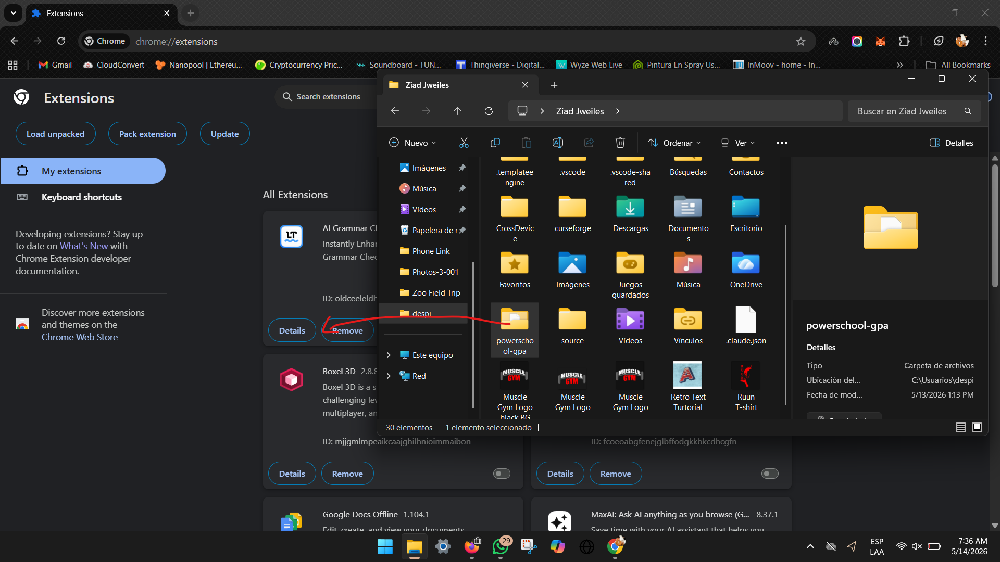

# Powerschool_GPA_Calculator
Chrome estension to calculate your GPA automatically

# 🧩 Chrome Extension — Developer Mode Installation

> Install this extension manually in Chrome using Developer Mode — no Chrome Web Store required.

---

## 📋 Prerequisites

- Google Chrome browser installed
- The extension folder downloaded or cloned from this repo

---

## 🚀 Installation Steps

### Step 1 — Open Chrome Extensions

Navigate to the Extensions page in Chrome:

```
chrome://extensions
```

Or go to: **Chrome Menu (⋮) → Extensions → Manage Extensions**

You'll see the Extensions page listing all your installed extensions.



---

### Step 2 — Enable Developer Mode

In the **top-right corner** of the Extensions page, toggle on **Developer mode**.



Once enabled, three new buttons will appear at the top:

| Button | Description |
|---|---|
| **Load unpacked** | Load your local extension folder |
| **Pack extension** | Package the extension into a `.crx` file |
| **Update** | Force-refresh all installed extensions |

---

### Step 3 — Load the Extension Folder

1. Click **"Load unpacked"**
2. A file picker dialog will open
3. Navigate to and **select the extension's root folder** (the one containing `manifest.json`)
4. Click **Select Folder**



> ⚠️ Make sure you select the **folder itself**, not a file inside it.

---

## ✅ Done!

The extension will now appear in your Extensions list and in the Chrome toolbar.

To **reload** the extension after making changes, click the 🔄 refresh icon on its card in `chrome://extensions`.

---

## 🛠️ Troubleshooting

**Extension not loading?**
- Confirm the folder contains a valid `manifest.json`
- Check the Chrome console for errors: Extensions page → Details → Inspect views

**Changes not reflecting?**
- Click the 🔄 refresh button on the extension card in `chrome://extensions`
